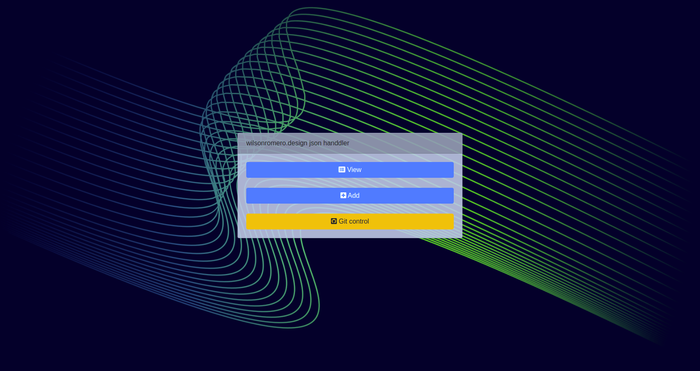
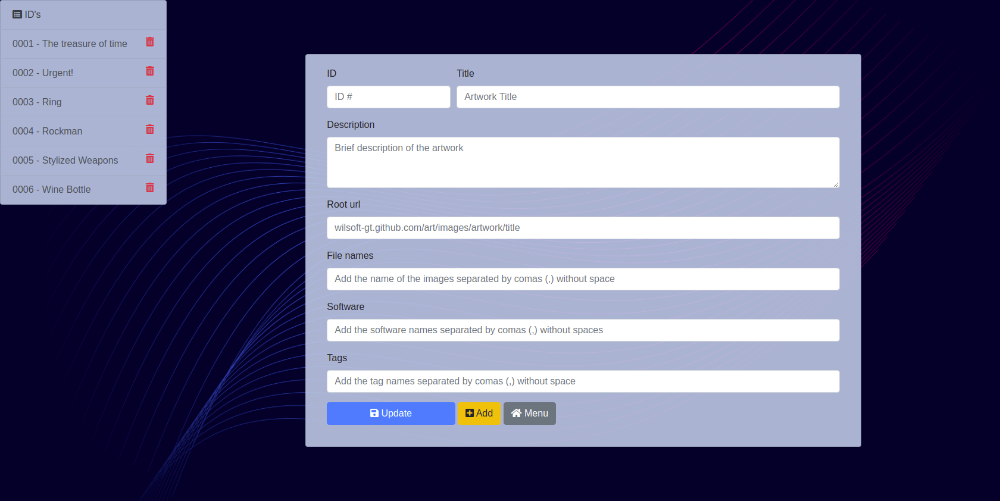
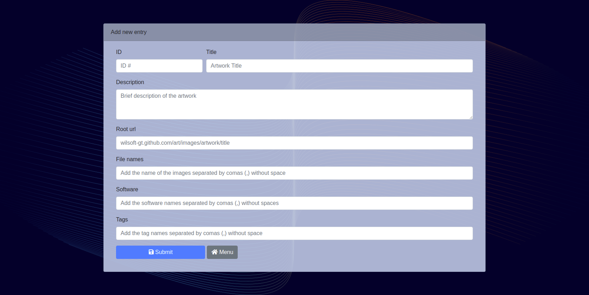

# webArtAdminApp
This is the app I use to manage my <a href="https://www.wilsonromero.design/art">art</a> website. This app is powered by django. What it does is basically read a json file and write to it the new data or remove the data. The json file is what I use as a database for my website.

## Screenshots
### Main Menu

### List of entries

### Add new post view

### Still working on the git options to add, commit and push from python

